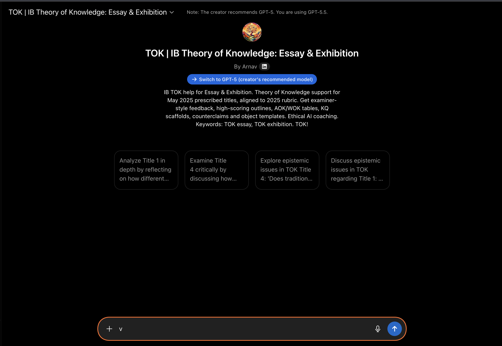

# TOK | IB Theory of Knowledge: Essay & Exhibition

Independent ChatGPT GPT for TOK IB Theory of Knowledge essay and exhibition support.

- Live GPT: https://chatgpt.com/g/g-fOitKYU60
- Website: https://tok-ib-theory-of-knowledge-gpt.vercel.app/
- Questions or support: tok@agentmail.to

## What It Helps With

- TOK IB study support
- TOK essay planning
- TOK exhibition object selection
- Prescribed title analysis
- Claim and counterclaim development
- Areas of knowledge comparison
- Knowledge question refinement
- Real-world example checks
- Rubric-style feedback
- Paragraph diagnosis: descriptive, analytical, or evaluative
- Word count and structure improvement

## Keywords

TOK IB, IB TOK, TOK, Theory of Knowledge, TOK essay, TOK exhibition, TOK essay guide, TOK essay word count, TOK essay structure, TOK essay examples, TOK essay feedback, TOK essay rubric, TOK exhibition objects, TOK IB guide, TOK IB questions, IB Theory of Knowledge, IBDP TOK, Diploma Programme TOK, AOK, areas of knowledge, knowledge questions, prescribed titles, claim, counterclaim, critical evaluation, ChatGPT TOK, Theory of Knowledge GPT, IB essay coach.

## Student-Safe Positioning

This GPT is a study coach, not an essay-writing service. It helps students plan, understand, critique, and revise their own work. It should not be used to generate final coursework for submission.

Use it to ask:

- Is my TOK essay plan focused on the title?
- Are my examples actually supporting a knowledge claim?
- Are my exhibition objects specific enough?
- Is my paragraph descriptive or evaluative?
- What is the weakest part of my argument?

## Pages

- [TOK Essay Guide](guides/tok-essay-guide.html)
- [TOK Essay Word Count](guides/tok-essay-word-count.html)
- [TOK Essay Structure](guides/tok-essay-structure.html)
- [TOK Essay Examples](guides/tok-essay-examples.html)
- [TOK Essay Feedback](guides/tok-essay-feedback.html)
- [TOK Exhibition Objects](guides/tok-exhibition-objects.html)
- [Theory of Knowledge GPT](guides/theory-of-knowledge-gpt.html)

## Disclaimer

This project is independent and is not affiliated with, endorsed by, or sponsored by the International Baccalaureate Organization or OpenAI. IB, International Baccalaureate, and related programme names belong to their respective owners.
